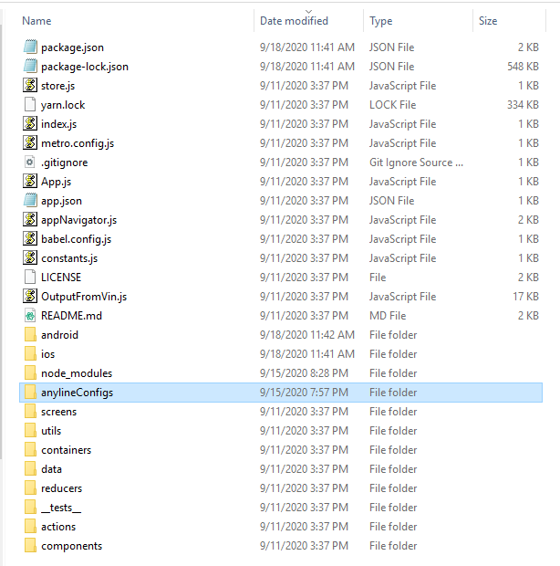

# Windows Installation Guide
Follow the instructions described below if you want to setup `RuinaMain` using Windows and Android Studio.

## Using a tablet
1. Follow [this](https://reactnative.dev/docs/environment-setup) react native tutorial (select React Native CLI Quickstart, Windows, and Android)
  * Make sure to select Android 9 (Pie) and Android SDK Platform 28 instead of the new versions. This can be done by following the green highlight portion in [this](https://docs.google.com/document/d/1Jq3eBB1jNj5tPj4pSyWM1NAS5JwnqvRIsML5aK6KDPE/edit?usp=sharing) google document
  * We recommend using [nvm-windows](https://github.com/coreybutler/nvm-windows) to install Node.js, so you can easily install multiple versions and switch between them. Install the latest Node.js version via `nvm install latest [arch]`. Don't forget to actually pick a Node.js version once you install it via `nvm use <version> [arch]`. Confirm you have Node.js installed by typing `node --version` in the command prompt
  * Since we use Gradle 5.5, as of now, you should install JDK version 11. You can download the Windows zip file for JDK 11 [here](https://jdk.java.net/java-se-ri/11). Extract the zip folder into `C:\Program Files\Java\` and then add `C:\Program Files\Java\jdk-11` to the System `Path` variable. To easily switch between different JDK version, I would recommend following [this tutorial](https://www.happycoders.eu/java/how-to-switch-multiple-java-versions-windows/). Confirm you have JDK installed by typing `java -version` in the command prompt    
  * In case you need to install Gradle, you can do that [here](https://gradle.org/install/)

  

2. Follow the first two steps of [this](https://reactnative.dev/docs/running-on-device) tutorial to connect a tablet with Android (select Android and Windows)

  

3. Clone the `RuinaMain` [repo](https://github.com/santosfamilyfoundation/RuinaMain)
  * In a terminal, `cd` into the main directory of the repo
  * `rmdir /s node_modules` if there exists a `node_modules` folder in the repo
  * `yarn install` (if `yarn` is not recognized as a command then run `npm install -g yarn` in a command prompt run as administrator)

4. In order to get the app running, you need to add the required Anyline config files   
  * To add them, create a new folder called `anylineConfigs` in your `RuinaMain` directory
  * Download all the files from [here](https://drive.google.com/drive/folders/1R-s-ASSDIUl32IrHriw40iRoKcLCaVOv), and put them in the `anylineConfigs` folder  

  

5. Rebuild the Android folder with the following commands
    * `cd android`
    * `gradlew clean`
    * `cd ..`

6. Run app via `npx react-native run-android` within the main `RuinaMain` directory (make sure your tablet is plugged in and registered as a device when you type `adb devices` into a terminal)

## Using an Emulator
**Note:** using an emulator requires the same steps as the above section but instead of doing step 2, you have to set up the emulator. You can do this by following the "Using a virtual device" section in the react native setup [tutorial](https://reactnative.dev/docs/environment-setup) (select React Native CLI Quickstart, Windows, and Android). Don't forget to launch your Android Virtual Device before running `npx react-native run-android`!
